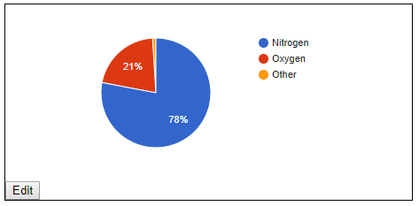

# tlx-chart

The module `tlx-chart` provides both a JavaScript component oriented and and reactive HTML custom element oriented [TLX](https://github.com/anywhichway/tlx) based wrapper for the [Google Charts library](https://developers.google.com/chart/). Although they have not all been tested yet, theoretically all charts in the [Google gallery](https://developers.google.com/chart/interactive/docs/gallery) should work.

# Installation

`npm install tlx-chart`

# Usage

To create a chart using HTML use the tag `tlx-chart` and provide attributes in hyphenated form that match the camelCased object keys used in the Google documentation, e.g.

```html
<tlx-chart id="mychart" 
	chart-type="PieChart" 
	chart-editable="true" 
	chart-columns="${['Element','Percentage']}" 
	chart-data="${[['Nitrogen',0.78],['Oxygen',0.21],['Other',0.01]]}"
</tlx-chart>
```

Will produce this chart:



You can also add event handlers. The ones below just log co-ordinates to the console.

```html
<tlx-chart id="mychart" 
	chart-type="PieChart" 
	chart-editable="true" 
	chart-columns="${['Element','Percentage']}" 
	chart-data="${[['Nitrogen',0.78],['Oxygen',0.21],['Other',0.01]]}" 
	chart-on="${{select: function() { console.log(this.getSelection())}, mouseover: (event) => console.log(event)}}"
</tlx-chart>
```

You can create charts from JavaScript using the factory function `tlxChart.create(config)`. The code below will produce the same chart.

```javascript
	const chart = tlxChart.create({
		chartType:"PieChart",
		chartEditable: true, 
		chartColumns: ['Element','Percentage'],
		chartData: [['Nitrogen',0.78],['Oxygen',0.21],['Other',0.01]],
		chartOn= {select: function() { console.log(this.getSelection())}, mouseover: (event) => console.log(event)}
	});
	document.body.appendChild(chart);
```

# Element Specification

## tlx-chart

A custom HTML element with a [`tlx`](https://github.com/anywhichway/tlx) wrapper that renders Google Charts.

### Attributes

`chart-type` - In alphabetical order (click on the names for examples), one of:
[BarChart](https://jsfiddle.net/anywhichway/jcpb1xkq/),
[BubbleChart](https://jsfiddle.net/anywhichway/yfdcn6mL/),
[ColumnChart](https://jsfiddle.net/anywhichway/fo1jq6ae/),
ComboChart,
[Gauge](https://jsfiddle.net/anywhichway/yv4tqL10/),
[LineChart](https://jsfiddle.net/anywhichway/u3Lmyjg0/),
[OrgChart](https://jsfiddle.net/anywhichway/6nmLx8b7/),
[PieChart](https://jsfiddle.net/anywhichway/vfL52j8d/),
[ScatterChart](https://jsfiddle.net/anywhichway/6j7uh9df/),
[Table](https://jsfiddle.net/anywhichway/x021fvtj/),
TreeMap.

`chart-editable` - A unary attribute, which if present, provides an Edit button the end user can click on to invoke an editor to change the chart type or appearance such as font labels, etc. Note, this editor does not support changing data. Use `tlx-chart-editor` element to change data.

`chart-columns` - An array of column names. The value must be inside "${ }" to tell the [`tlx`](https://github.com/anywhichway/tlx) engine to treat this as a JavaScript object, e.g. `chart-columns="${['Element','Percentage']}"`.

`chart-data` - An array of arrays, one for each row of data being charted. The value must be inside "${ }" to tell the [`tlx`](https://github.com/anywhichway/tlx) engine to treat this as a JavaScript object, e.g. `chart-data="${[['Nitrogen',0.78],['Oxygen',0.21],['Other',0.01]]}"`.

`chart-on` - An object, the property names of which are event names to respond to and the property values of which are event handler functions. The value must be inside "${ }" to tell the [`tlx`](https://github.com/anywhichway/tlx) engine to treat this as a JavaScript object, e.g. `chart-on="${{select: event => console.log(event)}}"`.

`defer` - A unary attribute that defers the first rendering of the chart until it is invoked by JavaScript. This is typically used when there is a lot of dynamic data that needs to assembled by JavaScript first. See the source of this [bubble chart example]((https://jsfiddle.net/anywhichway/yfdcn6mL/).

## tlx-chart-editor

A custom HTML element that renders a basic table to support user editing of the data associaed with a chart.

### Attributes

`for` - The DOM id of the chart associated with the editor. MUST BE FIRST ATTRIBUTE.

`chart-types` - An array of valid chart types. Diplayed as a select box in the top left of the chart editor.

`edit-columns` - An array of columns names to display for edit. If a column if not listed it is read-only.

`validate-data` - Typically, some column in the data will sum to a specific value, e.g. 100%, this function ensures the data meets the criteria prior to re-rendering the chart. The function you define that takes the arguments `(dataArray,event,view)`. It should return `true` if the data is valid and the chart will be re-rendered; otherwise, the chart is not re-rendered. If it returns a string, the string is displayed in a JavaScript alert box. If it returns an Error, the error is thrown.

# Custom Editors

With a little JavaScript and knowledge of [tlx](https://github.com/anywhichway/tlx), you can build a custom editor. See `configurable.html` in the examples directory or on [JSFiddle](https://jsfiddle.net/anywhichway/4ufgta7o/).

#API

It is also possible to create charts directly using JavaScript.

## TlxChart

`HTMLCustomElement TlxChart.create({attributes})` - The `attributes` is an object with properties the same name as the element attributes except camel cased, e.g. `chart-data` is `chartData`, and the values are JavaScript values, e.g.`"${[['Nitrogen',0.78],['Oxygen',0.21]]}"` is `[['Nitrogen',0.78],['Oxygen',0.21]]`. For non-string data, the returned custom element will have the attribute keys as properties rather than regular attributes retrievable via `getAttribute`.

`HTMLCustomElement TlxChart.Editor.create({attributes})` - The `attributes` is an object with properties the same name as the element attributes except camel cased. For non-string data, the returned custom element will have the attribute keys as properties rather than regular attributes retrievable via `getAttribute`.

More advanced use can be made by passing additional data, see the [tlx documentation](https://github.com/anywhichway/tlx) for more details.


# More Reading

[Charts and Gauges Without JavaScript](https://medium.com/@anywhichway/html-charts-without-javascript-760a6089bb91).

# Release History

2018-12-24 v0.0.8 Updated `tlx` dependency.

2018-12-11 v0.0.7 Added ability to specify `chart-types` and `edit-columns` for `tlx-chart-editor`.

2018-12-10 v0.0.6 Documentation updates.

2018-12-09 v0.0.5b Adjusted data editing validator.

2018-12-09 v0.0.4b Documentation updates. Added chart data editing.

2018-12-09 v0.0.3b Documentation updates. Added chart data editing.

2018-12-08 v0.0.2b Re-implemented to support most recent version of tlx.

2017-12-02 v0.0.1 ALPHA Initial public release

# License

MIT
